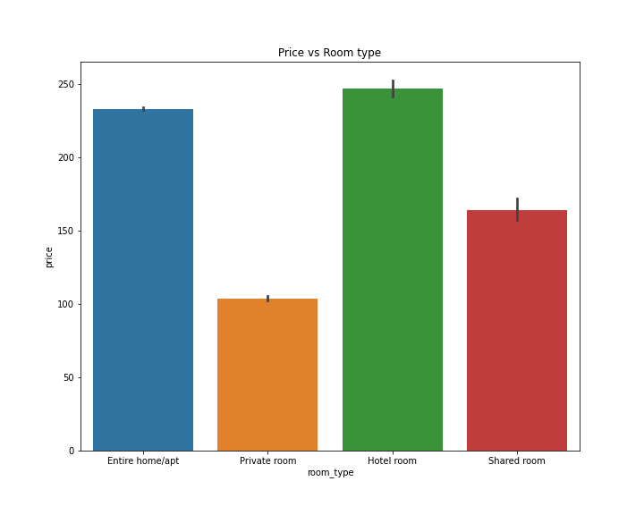

# capstone_

## Problem Statement:
AirBnB is a company founded in 2008. It allows home owners/renters to temporarily use their places as a hotel. The user has to put their own value per night for the guest to pay. I wanted to see if I could predict the price of an AirBnB in the New York City area. I was aiming at someone who has a space in the New York City area, and may want to use it for an AirBnB. I will try to give them an estimated price based on the borough they live in and other factors. I will also give them the errors with the model, as there are many factors I may not have such as their rent price or living expenses. The metrics I used to judge a model was R^2, mean squared error (MSE), root mean squared error (RMSE), and the average of the residuals (more on that later).

## The Data
The data was colected from this [website](http://insideairbnb.com). This is some data released from AirBnB. I downloaded the calendar and listings data from their New York file. A brief explaination of both is as follows. We are given an ID for both to merge them together. The calendar has all the dates that the AirBnB is available. They give dates, wheather or not it is available, price, and the minimum and maximum nights one can stay. The listings has much more information. We get information about its location, the host, specs about the AirBnB such as bedrooms and bathrooms, the type of stay, info about the reviews and much more.

The files are too big to upload to github. To download them, go to [inside airbnb](http://insideairbnb.com/get-the-data/), scroll down to "New York City, New York, United States" and download both listings.csv.gz and calendar.csv.gz

## Cleaning

To clean the data, I had to fix or delete much of the entries as well as merge the 2 dataframes together. First I dealt with the calendar dataset. This one was much simpilar as it had less columns. Here are the steps I took:

1. I turned the date column into a datetime type.
2. The avaliable column had entries t and f for true or false. I changed t to 1 and f to 0.
3. Fixed the price column into being a float type.
4. Droped the adjusted_price column.

With that the calendar dataframe is done. Now we will look at the listings data frame. Here are the steps I took to clean it up.

1. Drop all unneccisary columns. In total it was 46 columns. 
2. Filling nan values with the word 'unknown' in the following columns: host_response_time colunm, 'review_scores_rating', 'review_scores_accuracy', 'review_scores_cleanliness', 'review_scores_checkin', 'review_scores_communication', 'review_scores_location', and 'review_scores_value'
3. I fixed the price value to be a float value type
4. Then droped nan values

With that finished I then merged the 2 dataframes together. The new dataframe is called df_full. Naturally there was some null values. I dropped them since it took up less than 1% of the data. Lastly, I created a month column that was derived from the date columns.

Finally, I exported the data.

## Exploratory Data Analysis

Here, we will be looking at some EDA. let's look at some of the findings:

Price vs host_response_time:

A host that responds in a few days or more has the highest priced AirBnBs. The rest are roughly the same.

Price vs host_is_superhost:

They look about even with being a superhost maybe being a bit higher.

Price vs host_has_profile_pic:

Having a profile pic doesn't seem to effect the price of an AirBnB much.

Price vs host_identity_verified:

Having your identity verified at best gives a tiny edge on it not being verified.

Price vs boroughs:

Manhattan costs much more than the other boroughs of New York. Brooklyn is second highest priced, followed by Staten Island, Queens, and the Bronx has the lowest priced AirBnBs.

Price vs Room type:

Hotel_room and Entire home/apt AirBnBs cost the most. A private room costs the least.

Price vs Has Availability:

Having availability at best only gives a tiny price increase.

Price vs Instant Bookable:

There is no noticeable difference in having or not having instant bookable.

Price vs Months:

Only July seems to have an increase in price. But not by much

This heatmap shows which boroughs are most correlated with price:

## Modelling

To create the models, I will look at the entries for each borough and try to make a different model for each where needed. I'll make a baseline for each and look at various models for each borough. The baseline of the model I will use is the median of the borough price. I chose the median over the mean so that outliers don't sckew the data. We will try 5 different models to compare each borough to; linear regression, decision tree, bagging regressor, random forest, and extra trees. We will be judging the models on R^2, Mean squared error, Root mean squared error, and the mean of the residuals. The residuals are the mean of the absolute value of the actual value minus the predicted value.

### Manhattan:

The Manhattan model is the least accurate by every metric as we will see in a bit. Let's first look at the baseline of the Manhattan model:

#### Baseline:

| MSE       | RMSE   | Residuals   |
| --------- | ------ | ----------- |
| 293408.19 | 541.67 | 126.11      |

#### Linear Regression:

R^2:

Training R2: 0.141631773839774

Testing R2: 0.19491185140151768

| MSE   | RMSE  | Residuals   |
| ----- | ----- | ----------- |
| 175396.4 | 418.8 | 117.34 |

#### Decision Tree:

R^2:
Score on training set: 0.47327

Score on testing set: 0.60287

| MSE   | RMSE  | Residuals   |
| ----- | ----- | ----------- |
| 86519.47 | 294.14 | 13.62 |

#### Bagging Regressor:

R^2:
Score on training set: 0.47280

Score on testing set: 0.59523

| MSE | RMSE | Residuals |
| --- | ---- | --------- |
| 88183.01 | 296.96 | 13.9 |

#### Random Forest:

R^2:
Score on training set: 0.47327

Score on testing set: 0.60339

| MSE | RMSE | Residuals |
| --- | ---- | --------- |
| 86405.19 | 293.95 | 13.6 |

#### Extra Trees:

R^2:
Score on training set: 0.47327

Score on testing set: 0.60287

| MSE | RMSE | Residuals |
| --- | ---- | --------- |
| 86519.47 | 294.14 | 13.62 |

The models are slightly underfit but still better than the baseline.

Bagging seems to be the best models. I will go with bagging for the streamlit app.

### Staten Island:

These models are generally good. It has the best linear regression of all the boroughs based on all the metrics.

#### Baseline:

| MSE | RMSE | Residuals |
| --- | ---- | --------- |
| 14305.23 | 119.6 | 55.72 |

#### Linear Regression:

R^2:
Training R2: 0.97333

Testing R2: 0.97445

| MSE | RMSE | Residuals |
| --- | ---- | --------- |
| 337.15 | 18.36 | 7.56 |

#### Decision Tree:

R^2:
Score on training set: 0.97333

Score on testing set: 0.97445

| MSE | RMSE | Residuals |
| --- | ---- | --------- |
| 337.14 | 18.36 | 7.56 |

#### Bagging Regressor:

R^2:
Score on training set: 0.97331

Score on testing set: 0.97442

| MSE | RMSE | Residuals |
| --- | ---- | --------- |
| 337.53 | 18.37 | 7.64 |

#### Random Forest:

R^2:
Score on training set: 0.97333

Score on testing set: 0.97444

| MSE | RMSE | Residuals |
| --- | ---- | --------- |
| 337.31 | 18.37 | 7.55 |

#### Extra Trees:

R^2:
Score on training set: 0.97333

Score on testing set: 0.97445

| MSE | RMSE | Residuals |
| --- | ---- | --------- |
| 337.14 | 18.36 | 7.56 |

Decision Tree and Extra Trees are the best models here. So I'll go with the decision tree for the streamlit app.

### Bronx:

This borough has the best models based on R^2, MSE, RMSE, and residuals.

#### Baseline:

| MSE | RMSE | Residuals | 
| --- | ---- | --------- |
| 1481.31 | 38.49 | 29.7 |

#### Linear Regression:

R^2:
Training R2: 0.85720

Testing R2: 0.85789

| MSE | RMSE | Residuals |
| --- | ---- | --------- |
| 208.25 | 14.43 | 10.53 |

#### Decision Tree:

R^2:
Score on training set: 0.98882

Score on testing set: 0.98901

| MSE | RMSE | Residuals |
| --- | ---- | --------- |
| 16.11 | 4.01 | 2.13 |

#### Bagging Regressor:

R^2:
Score on training set: 0.98881

Score on testing set: 0.98897

| MSE | RMSE | Residuals |
| --- | ---- | --------- |
| 16.16 | 4.02 | 2.13 |

#### Random Forest:

R^2:
Score on training set: 0.98882

Score on testing set: 0.98901

| MSE | RMSE | Residuals |
| --- | ---- | --------- |
| 16.11 | 4.01 | 2.12  |

#### Extra Trees:

R^2:
Score on training set: 0.98882

Score on testing set: 0.98901

| MSE | RMSE | Residuals |
| --- | ---- | --------- |
| 16.11 | 4.01 | 2.13 |

Decision Tree and Extra Trees are the best models here. So I'll go with the decision tree for the streamlit app.

### Brooklyn:

This borough has the second best models after the Bronx based on R^2 scores. The linear regression model however, isn't good here.

#### Baseline:

| MSE | RMSE | Residuals |
| --- | ---- | --------- |
| 51664.94 | 227.3 | 79.99 |

#### Linear Regression:

R^2:
Training R2: 0.23615

Testing R2: 0.24419

| MSE | RMSE | Residuals |
| --- | ---- | --------- |
| 34223.04 | 184.99 | 58.23 |

#### Decision Tree:

R^2:
Score on training set: 0.98579

Score on testing set: 0.98443

| MSE | RMSE | Residuals |
| --- | ---- | --------- |
| 705.07 | 26.55 | 7.7 |

#### Bagging Regressor:

R^2:
Score on training set: 0.98578

Score on testing set: 0.98443

| MSE | RMSE | Residuals |
| --- | ---- | --------- |
| 705.17 | 26.55 | 7.7 |

#### Random Forest:

R^2:
Score on training set: 0.98578

Score on testing set: 0.98443

| MSE | RMSE | Residuals |
| --- | ---- | --------- |
| 705.02 | 26.55 | 7.7 |

#### Extra Trees:

R^2:
Score on training set: 0.98579

Score on testing set: 0.98443

| MSE | RMSE | Residuals |
| --- | ---- | --------- |
| 705.07 | 26.55 | 7.7 |

Random Forest is the best model. So we will use that for the streamlit app.

### Queens:

These models are overall very good based on all metrics.

#### Baseline:

| MSE | RMSE | Residuals |
| --- | ---- | --------- |
| 12372.58 | 111.23 | 47.75 |

#### Linear Regression:

R^2:
Training R2: 0.67111

Testing R2: 0.67306

| MSE | RMSE | Residuals |
| --- | ---- | --------- |
| 3922.99 | 62.63 | 39.75 | 

#### Decision Tree:

R^2:
Score on training set: 0.92299
Score on testing set: 0.92385

| MSE | RMSE | Residuals |
| --- | ---- | --------- |
| 913.73 | 30.23 | 18.66 |

#### Bagging Regressor:

R^2:
Score on training set: 0.92298

Score on testing set: 0.92383

| MSE | RMSE | Residuals |
| --- | ---- | --------- |
| 913.99 | 30.23 | 18.67 |

#### Random Forest:

R^2:
Score on training set: 0.92299

Score on testing set: 0.92386

| MSE | RMSE | Residuals |
| --- | ---- | --------- |
| 913.63 | 30.23 | 18.66 |

#### Extra Trees:

R^2:
Score on training set: 0.92299

Score on testing set: 0.92385

| MSE | RMSE | Residuals |
| --- | ---- | --------- | 
| 913.73 | 30.23 | 18.66 |

Decision Tree and Extra Trees are the best models here. So I'll go with the decision tree for the streamlit app.

## Streamlit App

I made a streamlit app under the name interactive.py. In it one can put in the following specs of their AirBnB:

* How many people it accomodates
* How many beds are there
* Is the room private
* Will the customer get the entire AirBnB
* Latitude
* Longitude
* Maximum nights one is allowed to stay
* If the host identity is verified
* If the host responds within a few hours
* If the host is a superhost.

After that, select the borough and the app will spit out an estimated price.

## Conclusion

In conclusion, I was able to make a model that did as I wanted it to. My goal was to estimate the price of an AirBnB in the New York area, and have a potential AirBnB'r use it to determine the estimated price of there place. I was able to do this in all 5 boroughs, with all except Manhattan having an R^2 score of over 92%. Overall, I would say the project was a success.

If given more time I would try to use GridSearch models to get even more accuarate models. I would also try to make the Streamlit app even cleaner looking and a bit more user friendly. If possible, I might try to look for more data to include things like average income of the neighborhood or square feet of the AirBnB. I think that could be valuable information in creating a good model. 
