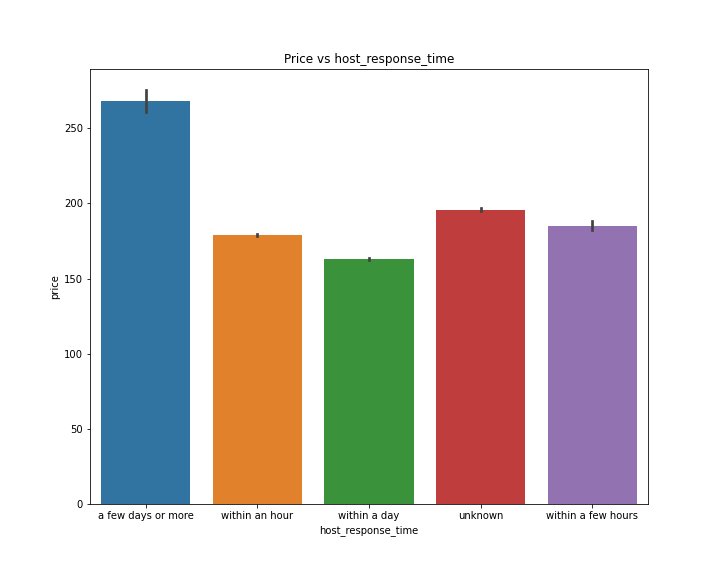
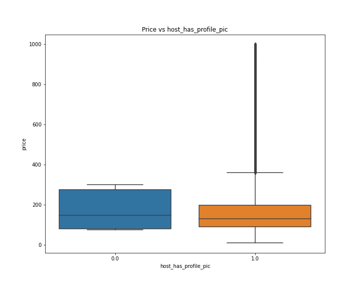
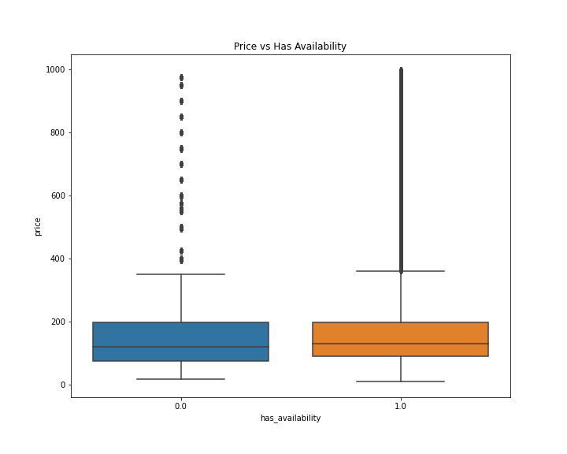

# capstone_

## Problem Statement:
AirBnB is a company founded in 2008. It allows home owners/renters to temporarily use their places as a hotel. The user has to put their own value per night for the guest to pay. I wanted to see if I could predict the price of an AirBnB in the New York City area. I was aiming at someone who has a space in the New York City area, and may want to use it for an AirBnB. I will try to give them an estamated price based on the borough they live in and other factors. I will also give them the errors with the model, as there are many factors I may not have such as their rent price or living expenses.

## The Data
The data was colected from http://insideairbnb.com/get-the-data/. This is some data released from AirBnB. I downloaded the calendar and listings data from their New York file. A brief explaination of both is as follows. We are given an ID for both to merge them together. The calendar has all the dates that the AirBnB is available. They give dates, wheather or not it is available, price, and the minimum and maximum nights one can stay. The listings has much more information. We get information about its location, the host, specs about the AirBnB such as bedrooms and bathrooms, the type of stay, info about the reviews and much more.

The files to the csv are here:

* [`calendar.csv`](./data/calendar.csv)

* [`listings.csv`](./data/listings.csv)

## Cleaning

To clean the data, I had to fix or delete much of the entries as well as merge the 2 dataframes together. First I dealt with the calendar dataset. This one was much simpilar as it had less columns. Here are the steps I took:

1. I turned the date column into a datetime type.
2. The avaliable column had entries t and f for true or false. I changed t to 1 and f to 0.
3. Fixed the price column into being a float type.
4. Droped the adjusted_price column.

With that the calendar dataframe is done. Now we will look at the listings data frame. Here are the steps I took to clean it up.

1. Drop unneccisary columns. I droped at different parts of the cleaning but will only put it here once. Here is a full list of the columns that I droped: 'listing_url', 'scrape_id', 'last_scraped', 'name', 'listing_url', 'scrape_id', 'last_scraped', 'name', 'picture_url', 'host_url', 'host_name', 'host_since', 'host_thumbnail_url', 'host_picture_url', 'calendar_last_scraped', 'host_location', 'description', 'neighborhood_overview', 'host_about', 'host_response_rate', 'host_acceptance_rate', 'neighbourhood', 'bathrooms', 'bathrooms_text', 'bedrooms', 'calendar_updated', 'first_review', 'last_review', 'license', 'host_neighbourhood', 'reviews_per_month', 'host_total_listings_count', 'minimum_minimum_nights', 'maximum_minimum_nights', 'minimum_maximum_nights', 'maximum_maximum_nights', 'minimum_nights_avg_ntm', 'maximum_nights_avg_ntm', 'availability_30', 'availability_60', 'availability_90', 'number_of_reviews_ltm', 'number_of_reviews_l30d', 'calculated_host_listings_count_entire_homes', 'calculated_host_listings_count_private_rooms', and 'calculated_host_listings_count_shared_rooms'.
2. Filling nan values with the word 'unknown' in the following columns: host_response_time colunm, 'review_scores_rating', 'review_scores_accuracy', 'review_scores_cleanliness', 'review_scores_checkin', 'review_scores_communication', 'review_scores_location', and 'review_scores_value'
3. I fixed the price value to be a float value type
4. Then droped nan values

With that finished I then merged the 2 dataframes together. The new dataframe is called df_full. Naturally there was some null values. I dropped them since it took up less than 1% of the data. Lastly, I created a month column that was derived from the date columns.

Finally, I exported the data. You can view it here:

* [`df_full.csv`](./data/df_full.csv)

## Exploratory Data Analysis

Here, we will be looking at some EDA. let's look at some of the findings:

Price vs host_response_time:

A host that responds in a few days or more has the highest priced AirBnBs. The rest are roughly the same.

Price vs host_is_superhost:

They look about even with being a superhost maybe being a bit higher.

Price vs host_has_profile_pic:

Having a profile pic doesn't seem to effect the price of an AirBnB much.

Price vs host_identity_verified:

Having your identity verified at best gives a tiny edge on it not being verified.

Price vs boroughs:

Manhattan costs much more than the other boroughs of New York. Brooklyn is second highest priced, followed by Staten Island, Queens, and the Bronx has the lowest priced AirBnBs.

Price vs Room type:

Hotel_room and Entire home/apt AirBnBs cost the most. A private room costs the least.

Price vs Has Availability:

Having availability at best only gives a tiny price increase.

Price vs Instant Bookable:

There is no noticeable difference in having or not having instant bookable.

Price vs Months:

Only July seems to have an increase in price. But not by much

This heatmap shows which boroughs are most correlated with price:

## Modelling

To create the models, I will look at the entries for each borough and try to make a different model for each where needed. I'll make a baseline for each and look at various models for each borough. The baseline of the model I will use is the median of the borough price. I chose the median over the mean so that outliers don't sckew the data. We will try 5 different models to compare each borough to; linear regression, decision tree, bagging regressor, 

### Manhattan:

The Manhattan model is the least accurate as we will see in a bit. Let's first look at the baseline of the Manhattan model:

#### Baseline:

MSE: 293408.1920075854
RMSE: 541.6716643942024
Residuals: 126.11349825279127

#### Linear Regression:

R^2:
Training R2: 0.141631773839774
Testing R2: 0.19491185140151768

MSE: 175396.3974895145
RMSE: 418.803530894278
Residuals: 117.34281586432186

#### Decision Tree:

R^2:
Score on training set: 0.47327498499947585
Score on testing set: 0.6028663936001599

MSE: 86519.4749243413
RMSE: 294.14192989837625
Residuals: 13.617887454514777

#### Bagging Regressor:

R^2:
Score on training set: 0.47280214893033623
Score on testing set: 0.59523060376535

MSE: 88183.00708705328
RMSE: 296.9562376631501
Residuals: 13.903125737731443

#### Random Forest:

R^2:
Score on training set: 0.4732710850238875
Score on testing set: 0.6033909604476098

MSE: 86405.19286038929
RMSE: 293.94760223616265
Residuals: 13.603366390914191

#### Extra Trees:

R^2:
Score on training set: 0.47327498499947573
Score on testing set: 0.6028663936001599

MSE: 86519.4749243413
RMSE: 294.14192989837625
Residuals: 13.617887454514777

The models are slightly underfit but still better than the baseline.

Bagging seems to be the best models. I will go with bagging for the streamlit app.

### Staten Island:

These models are generally good. It has the best linear regression of all the boroughs.

#### Baseline:

MSE: 14305.233561643836
RMSE: 119.60448804975437
Residuals: 55.72054794520548

#### Linear Regression:

R^2:
Training R2: 0.9733313324844002
Testing R2: 0.9744491143128797

MSE: 337.1530138825717
RMSE: 18.361726876374448
Residuals: 7.564854452054795

#### Decision Tree:

R^2:
Score on training set: 0.9733315022216071
Score on testing set: 0.9744500709956425

MSE: 337.1403901136449
RMSE: 18.361383120931954
Residuals: 7.5585589891145

#### Bagging Regressor:

R^2:
Score on training set: 0.9733123505922943
Score on testing set: 0.9744209033250809

MSE: 337.52526788885
RMSE: 18.37186076283102
Residuals: 7.636950988061424

#### Random Forest:

R^2:
Score on training set: 0.9733300689324852
Score on testing set: 0.9744372153071654

MSE: 337.3100254902293
RMSE: 18.3660018918171
Residuals: 7.546183324322898

#### Extra Trees:

R^2:
Score on training set: 0.9733315022216071
Score on testing set: 0.9744500709956425

MSE: 337.14039011364497
RMSE: 18.361383120931958
Residuals: 7.558558989114516

Decision Tree and Extra Trees are the best models here. So I'll go with the decision tree for the streamlit app.

### Bronx:

This borough has the best models.

#### Baseline:

MSE: 1481.3062785388129
RMSE: 38.48774192569386
Residuals: 29.70433789954338

#### Linear Regression:

R^2:
Training R2: 0.8571985277314411
Testing R2: 0.8578894589148285

MSE: 208.24912690807247
RMSE: 14.430839438787768
Residuals: 10.531000612429917

#### Decision Tree:

R^2:
Score on training set: 0.9888160419467622
Score on testing set: 0.9890075801431886

MSE: 16.108318357721032
RMSE: 4.013516956202008
Residuals: 2.1321772593829293

#### Bagging Regressor:

R^2:
Score on training set: 0.9888120445955765
Score on testing set: 0.9889705258511065

MSE: 16.16261780599123
RMSE: 4.020275837052879
Residuals: 2.127471242963113

#### Random Forest:

R^2:
Score on training set: 0.988815684910948
Score on testing set: 0.9890069237984309

MSE: 16.109280166899293
RMSE: 4.013636775656125
Residuals: 2.12941708540968

#### Extra Trees:

R^2:
Score on training set: 0.9888160419467622
Score on testing set: 0.9890075801431886

MSE: 16.108318357721032
RMSE: 4.013516956202008
Residuals: 2.1321772593829396

Decision Tree and Extra Trees are the best models here. So I'll go with the decision tree for the streamlit app.

### Brooklyn:

This borough has the second best models after the Bronx. The linear regression model however, isn't good here.

#### Baseline:

MSE: 51664.94394049151
RMSE: 227.29923875915534
Residuals: 79.9874885123958

#### Linear Regression:

R^2:
Training R2: 0.23614506938114876
Testing R2: 0.2441888702106123

MSE: 34223.0373617357
RMSE: 184.99469549621065
Residuals: 58.22872328815034

#### Decision Tree:

R^2:
Score on training set: 0.9857853579984303
Score on testing set: 0.9844286292511029

MSE: 705.0698010512767
RMSE: 26.55315049200898
Residuals: 7.699352561114326

#### Bagging Regressor:

R^2:
Score on training set: 0.9857823912653305
Score on testing set: 0.9844264832704798

MSE: 705.1669707966654
RMSE: 26.55498015056056
Residuals: 7.698506449112763

#### Random Forest:

R^2:
Score on training set: 0.9857848707447079
Score on testing set: 0.9844297674782121

MSE: 705.018262264204
RMSE: 26.552179990806856
Residuals: 7.698351297468124

#### Extra Trees:

R^2:
Score on training set: 0.9857853579984303
Score on testing set: 0.9844286292511029

MSE: 705.0698010512764
RMSE: 26.553150492008974
Residuals: 7.699352561114326

Random Forest is the best model. So we will use that for the streamlit app.

### Queens:

These models are overall very good.

#### Baseline:

MSE: 12372.576095273356
RMSE: 111.23208213134085
Residuals: 47.750573861532764

#### Linear Regression:

R^2:
Training R2: 0.6711136176693455
Testing R2: 0.6730646354403718

MSE: 3922.9925580837375
RMSE: 62.63379725103483
Residuals: 39.74589721731444

#### Decision Tree:

R^2:
Score on training set: 0.9229920151689808
Score on testing set: 0.9238511265992795

MSE: 913.7324867252249
RMSE: 30.228008315554384
Residuals: 18.656372874490017

#### Bagging Regressor:

R^2:
Score on training set: 0.9229761235119394
Score on testing set: 0.9238294210101952

MSE: 913.9929384036823
RMSE: 30.23231612701353
Residuals: 18.66594178789647

#### Random Forest:

R^2:
Score on training set: 0.922991193675232
Score on testing set: 0.923859534322173

MSE: 913.631600012079
RMSE: 30.226339507325047
Residuals: 18.65645526128962

#### Extra Trees:

R^2:
Score on training set: 0.9229920151689808
Score on testing set: 0.9238511265992795

MSE: 913.7324867252249
RMSE: 30.228008315554384
Residuals: 18.656372874490017

Decision Tree and Extra Trees are the best models here. So I'll go with the decision tree for the streamlit app.

## Streamlit App

I made a streamlit app under the name interactive.py. In it one can put in the following specs of their AirBnB:

* How many people it accomodates
* How many beds are there
* Is the room private
* Will the customer get the entire AirBnB
* Latitude
* Longitude
* Maximum nights one is allowed to stay
* If the host identity is verified
* If the host responds within a few hours
* If the host is a superhost.

After that, select the borough and the app will spit out an estimated price.

## Conclusion

In conclusion, I was able to make a model that did as I wanted it to. My goal was to estimate the price of an AirBnB in the New York area, and have a potential AirBnB'r use it to determine the estimated price of there place. I was able to do this in all 5 boroughs, with all except Manhattan having an R^2 score of over 92%. Overall, I would say the project was a success.